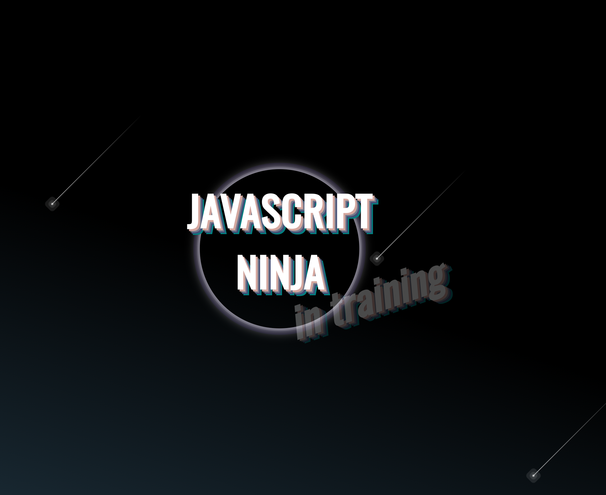

## Welcome to my portfolio

I am a Front End Developer, and this is a showcase of what I have learned during my one-year course at Digital Career Institute. This project was created using Next.js and bootstrapped with create-next-app.

### Project Status: _complete_ 
**The project is now complete and can be viewed live.** [here](https://portfolio2023-eta.vercel.app/)

###Technologies
The project is built using the following technologies:

- React
- JavaScript
- Next.js
- Tailwind CSS
- React Icons
- React PDF
- React Visibility Sensor
- Anime.js
- dotenv
- pdf-loader
- emailjs

